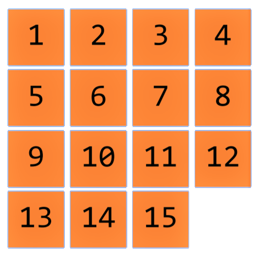
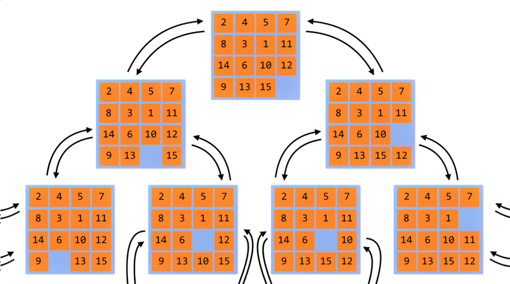
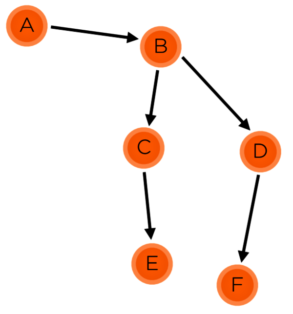
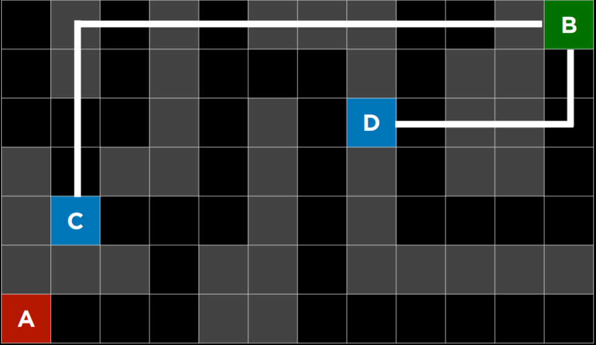
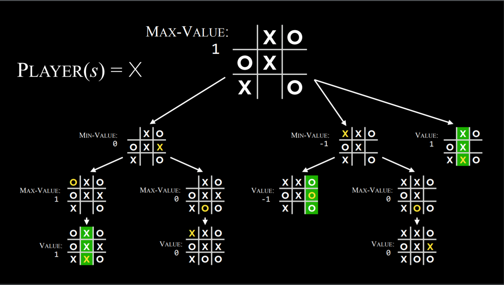
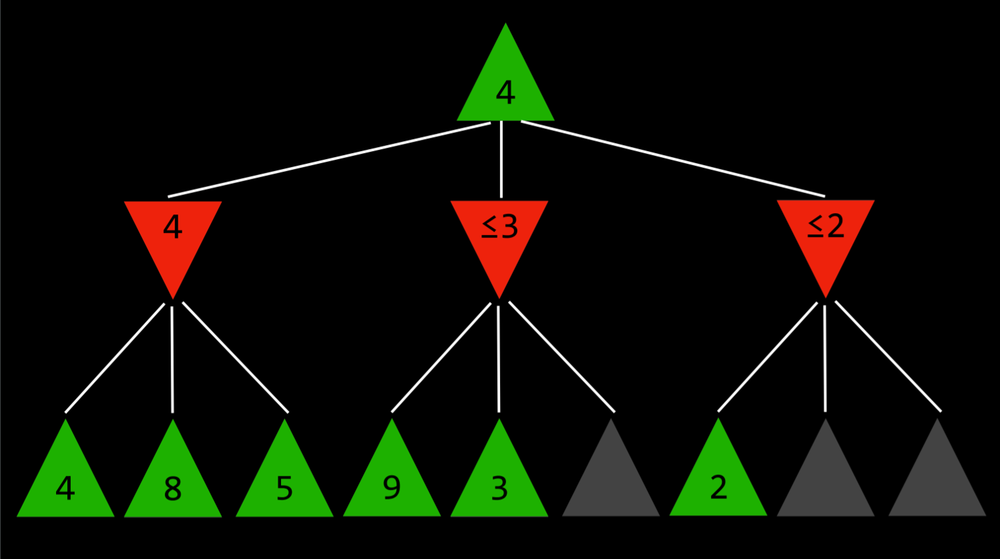

# Semana 0: Busca
Aqui estão as anotações escritas durante a aula da [Semana 0: Busca](https://cs50.harvard.edu/ai/2020/weeks/0/). Todas as imagens aqui incluídas são de autoria de CS50. As implementações dos algoritmos aqui descritos estão nos arquivos nesta pasta.
## Problemas de Busca
---
Definimos um problema de busca como qualquer problema que, baseada em estados e um conjunto de regras, tenta, a partir de um estado inicial, chegar num estado-objetivo. Um estado é uma instância do problema - uma das possíveis configurações que nosso problema pode ter - um estado pode ser uma configuração de um jogo de damas, uma posição num labirinto ou um valor entre 0 à 1, desde que esta representação esteja ligada à um conjunto de regras que forma o problema.

\
Um possível estado de O jogo do 15.

Somente tal informação não é o suficiente, é necessário que tenhamos controle sobre o caminho que já fizemos, para que possamos voltar atrás no que fizemos. Para resolver este problema implementamos uma estrutura de dados, `Node`, uma classe que guarda o estado, outro Node e a ação aplicada que deu origem à ele e um custo - o custo total até chegar neste nó.

```Python
class Node:

    def __init__(self, state, parent = None, action = None, cost = None):
        self.state = state
        self.parent = parent
        self.action = action
        self.cost = cost

```

Atrelar um valor de custo para as ações indica que, a cada passo, temos pagar o custo para realizá-la e, nestas situações, não basta somente encontrarmos uma solução, mas encontrarmos a **melhor** solução: A **solução ótima** é o caminho cujo custo total é o menor dentro todos os outros caminhos que são solução para o problema.

Para resolver o problema temos de 'andar' por meio dos diferentes estados do problema por meio de ações. Dado um estado qualquer, é possível gerar outros estados por meio da aplicação de ações possíveis sobre o estado dado. O conjunto de estados alcançáveis a partir da aplicação de uma ação sobre um evento é chamado Espaço daquele evento.



## Resolvendo problemas de Busca
---
A ideia geral ao buscarmos um caminho que seja solução do problema é de expansão, exploração e verificação. A partir de um estado podemos expandí-lo para gerar novos estados e explorar a partir deles para enfim verificarmos se chegamos em nosso objetivo.
Definiremos duas estruturas de dados que farão a parte de expansão e exploração do problema: A **fronteira** e o conjunto de **exploração**: A fronteira é o conjunto que compõe os nós que ainda não foram explorados, mas que são possíveis de se alcançar a partir do estado inicial por um número contável de ações, enquanto o conjunto de exploração coleta todos os nós que foram explorados e não são o estado-objetivo.

 ```Python
class Search:

    def __init__(self, inicial):
        self.frontier = [Node(inicial)]
        self.exploration = set()

 ```

E seguimos os seguintes passos
> * Iniciamos Search com um estado inicial
> * Repetimos:
>   * Se a Fronteira for vazia, não há solução
>   * Retire um Nó da Fronteira e inclua-o no conjunto Exploração
>   * Expanda a Fronteira a partir deste Nó
>   * A cada Nó no espaço do estado retirado faça:
>       * Se for o estado-objetivo, pare
>       * Se ele não está nem na Fronteira nem no Exploração, inclua-o na Fronteira

Esta é a estrutura básica de um algoritmo de busca que encontra uma solução, desde que ela seja alcançável por um número finito de ações. O que diferenciará os algoritmos aqui citados é *como* é escolhido o Nó a ser retirado da Fronteira a cada iteração.

### Busca em profundidade
---
A busca em profundidade, ou Depth-First Search (DFS) em inglês, é o algoritmo cujo funcionamente é por caminhos: A busca ocorre escolhendo um caminho e procurando a solução sobre ele até que o caminho cesse ou acuse nenhuma solução, para então buscar sobre outro caminho.



O funcionamento do DFS sobre o grafo acima, quando B é retirado da fronteira, o algoritmo escolheria C ou D para buscar, e então buscaria sobre o caminho escolhido até que encontrasse seu final, para então retornar à última ramificação. Assim, o DFS faria sua busca
```
A -> B -> C -> E (Fim do caminho) -> D -> F
ou
A -> B -> D -> F (Fim do caminho) -> C -> E
```

Para obter este comportamento, a estrutura de dados que deve compor nossa Fronteira é de uma **pilha**, o último Nó a ser inserido é o Nó a ser retirado.

* Prós:
  * O algoritmo, com sorte, encontra a solução com rapidez se a solução for um dos caminhos escolhidos a serem seguidos primeiro.
* Contras:
  * A solução não necessariamente é ótima, o algoritmo retorna a primeira solução encontrada
  * No pior caso, a solução é o último caminho a ser seguido
### Busca em largura
---
A busca em largura, ou Breadth-First Search (BFS) em inglês, é o algoritmo que percorre todos os possíveis caminhos ao mesmo tempo, se afastando do estado inicial de forma homogênea. Considerando o mesmo problema dos grafos, o BFS faria sua busca

> A -> B -> C -> D -> E -> F

Para obter este comportamento, nossa Fronteira deve ser composta por uma **fila**, o Nó mais antigo da fronteira é o primeiro a ser retirado.

* Prós:
  * O algoritmo garante que a solução - se existir - é ótima
* Contras:
  * O tempo de execução do algoritmo é garantido de ser maior ou igual ao tempo mínimo de execução
  * No pior caso, a solução é o caminho mais longo

## Busca informada
---
As buscas em largura e em profundidade são algoritmos utilizados quando não temos informações acerca do quão longe estamos do estado-objetivo. Numa **busca informada**, definimos uma **função heurística**, $h(x)$, que nos dá uma estimativa do quão próximo do objetivo estamos. Quanto menor for a função heurística num evento, maior é sua proximidade com o evento objetivo. O maior desafio neste tipo de busca é encontrar a função heurística apropriada.
### Busca do melhor-primeiro
---
No caso em que sabemos o valor da função heurística para cada evento na fronteira, passamos a escolher o nó a ser retirado não por uma escolha posicional ou aleatória, mas pelo valor da função heurística de cada Nó.\
A primeira ideia possível é escolher simplesmente o Nó cuja função heurística seja a menor da fronteira. Por exemplo, num problema de labirinto, uma função heurística possível é a norma-1



No exemplo acima, o estado D é mais próximo do objetivo que o estado C. Caso ambos estivessem na fronteira, o Nó D seria escolhido.

* Prós:
  * O algoritmo, em média, tem uma performance superior em relação aos algoritmos de busca não informada
* Contras:
  * Não garante que a solução seja ótima, apenas pega o caminho de menor distância média do objetivo
  * A performance do algoritmo está unicamente relacionada à função heurística utilizada

### Algoritmo A*
---
O algoritmo A* tenta resolver um dos contras do algoritmo de melhor-primeiro, em que é considerada apenas a distância média do caminho até o objetivo e não distância percorrida no caminho. Para isso, uma nova função é incluída à função heurística, a função $g(x)$, cuja saída é o menor número de eventos percorridos do evento inicial até ele. Então, escolhemos da fronteira o Nó cujo valor de $f(x)+g(x)$ seja o menor.

Nesta ótica, caso iniciamos percorrendo um caminho que promete ser mais próximo do objetivo, mas o caminho em si demore, pegamos outro caminho menos promissor, mas de pode levar menos ações para chegar ao objetivo. Novamente, a performance do algoritmo depende exclusivamente da qualidade da função heurística. Para que o algoritmo A* encontre a solução ótimo é necessário que a função seja
1. _Admissível_: Seu valor nunca superestima o custo real
2. _Consistente_: Para cada nó $n$ e sucessor $n'$, de custo $c$, $h(n') \geq h(n)-c$
## Minimax
---
Dos problemas de busca, existem problemas (bem comuns) em que 2 agentes (ou jogadores) se enfrentam para chegar num objetivo próprio, em que apenas 1 pode ganhar ou ambos podem empatar. Nestas configurações, nosso modelo anterior pode falhar em representar este problema, pois não existe um evento-objetivo, mas pelo menos 2 distintos. Chamamos os eventos-objetivo como eventos terminais e a cada um destes eventos terminais relacionamo-os com um valor que indica a vitória de um jogador (ou um empate), chamamos este valor de utilidade de um estado terminal. Por exemplo, num jogo da velha existem diversos estados terminais baseados na configuração das peças, podemos relacionar os estados com sua utilidade de

* 0, se houver um empate (uma velha)
* 1, caso o jogador com X vença
* -1, caso o jogador com O vença

Nestes problemas, um dos jogadores que obter um estado terminal cuja utilidade seja a menor possível, enquanto o outro deseja maximizar a utilidade do estado terminal. O algoritmo minimax tenta resolver este problema de uma forma recursiva: ele se aprofunda nos estados do jogo supondo como o outro jogador, e ele mesmo, jogariam.

Dado um estado inicial com um jogador inicial, o algoritmo tenta prever, baseado em todos os possíveis eventos após todas as ações possíveis do jogador inicial, quais ações o outro jogador faria para maximizar a utilidade, que por sua vez, tentaria prever o que o primeiro jogador fará para minimizar, e assim por diante, até que alcance todos os eventos terminais possíveis, para assim, determinar sua ação


Na imagem, o jogador X prevê todos os possíveis estados terminais para determinar a ação de maior utilidade.

Assim, por turnos, são chamadas as funções para o jogador Min e Max:
```python
def max_player(state):
    if state.is_terminal():
        return None
    
    v = -∞
    for action in Action(state):
        v = max(v, min_player(state.play(action)))
    
    return v
```
```python
def min_player(state):
    if state.is_terminal():
        return state.utility()
    
    v = ∞
    for action in Action(state):
        v = min(v, max_player(state.play(action)))
    
    return v
```

### Alpha-Beta Pruning
---
O algoritmo Minimax pode se tornar bem ineficiente dependendo dos possíveis eventos possíveis, para otimizar o algoritmo podemos introduzir uma busca mais inteligente. Para evitar descidas desnecessárias até estados terminais claramente desfavoráveis. Num turno de Max, cada ação é avaliada, caso numa nova avaliação o próximo turno possuir uma utilidade menor que uma ação já avaliada, esta nova ação nunca será máximo, e portanto, podemos interromper a busca daquele nó.


No exemplo acima, quando um nó encontra uma utilidade menor que a anterior, ela nunca será maximizada (pois o outro jogador nunca escolherá uma jogada maior que a já encontrada) e portanto não é necessário buscas posteriores naquele nó.

### Minimax com profundidade limitada
---
Jogos complexos podem derivar um grafo extremamente grande de se explorar e chegar em seus estados terminais pode tomar muitos eventos, o que deixa o algoritmo Minimax inviável. Para resolver este problema, podemos ao invés de descermos até um estado terminal, descermos até uma certa profundidade e avaliar a **utilidade esperada** daquele evento. Esta avaliação pode levar em conta diversos aspectos do estado e nem sempre é fácil de se determinar, mas em jogos mais complexos, corta o tempo de execução de Minimax consideralvemente.
